# Full Stack Development Project 2

## Pomodoro timer

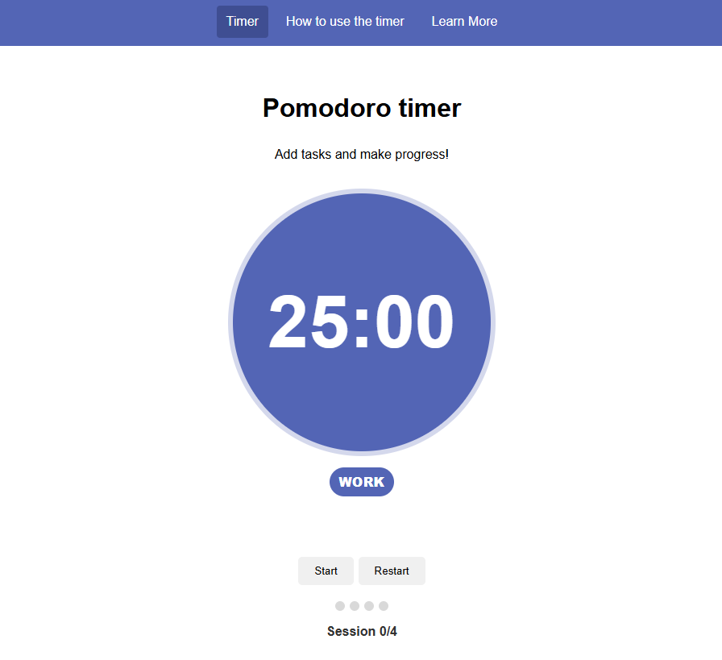
This project is a simple, responsive Pomodoro Timer web application designed to help users improve focus, manage their time effectively, and reflect on how their work went.

The application is built using HTML, CSS, and JavaScript.

## Table of contents:
1. [**Live Site**](#live-site)
1. [**Project Purpose**](#project-purpose)
    * [***Target Audience***](#target-audience)
    * [***User Stories***](#user-stories)
1. [**Features**](#features)
    * [***Pomodoro Timer***](#pomodoro-timer-1)
    * [***Session Tracker***](#session-tracker)
    * [***Task List***](#task-list)
    * [***Session Feedback***](#session-feedback)
    * [***How to Use the Timer***](#how-to-use-the-timer-page)
    * [***Learn More***](#learn-more-page)
1. [**Bugs**](#bugs)
1. [**Testing**](#testing)
    * [***Manual Testing***](#manual-testing)
    * [***Automated Testing***](#automated-testing)
    * [***Responsiveness Testing***](#responsiveness-testing)
1. [**Deployment**](#deployment)
    * [***Deployment Steps***](#deployment-steps)
1. [**Credits**](#credits)
    * [***Code From Tutorials***](#code-from-tutorials)
1. [**Future Improvements**](#future-improvements)

## Live Site

- Github page: [Pomodoro Timer](https://gibba42.github.io/full_stack_development_project2/)
- Source code: [GitHub Repository](https://github.com/gibba42/full_stack_development_project2)

## Project Purpose

The purpose of this project is to create an interactive front-end web application that helps users apply the Pomodoro Technique to their daily work. 

The application allows users to:
- Track focused work sessions
- Take structured breaks
- Manage tasks
- Reflect on productivity through session feedback

### Target Audience

This application is aimed at:
- Students
- Developers
- Writers
- Users with ADHD and other nerodiversity 
- Anyone who wants to improve their productivity

### User Stories

As a user, I want an easy to use Pomodoro timer.
As a user, I want to be able to track my to-do list.
As a user, I want to be able to create my own list of tasks.
As a user, I want to be able to track which tasks I've completed.
As a user, I want to be able to improve my productivity.
As a user, I want to be able to capture feedback on how my work went.
As a user, I want to learn more about the Pomodoro method.

## Features:

The site aims to fullfil the above user stories by providing the following features:

### Pomodoro Timer
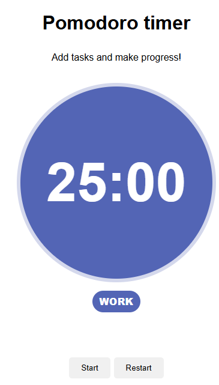
- 25-minute work sessions
- 5-minute short breaks
- Automatic **20-minute long break after 4 work sessions**
- Start, pause, and restart controls
- Clear visual indicator for work/break mode

### Session Tracker
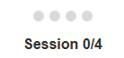
- Visual dot tracker showing completed work sessions
- Session counter (e.g. Session 2/4)
- Automatically resets after long break or restart

### Task List
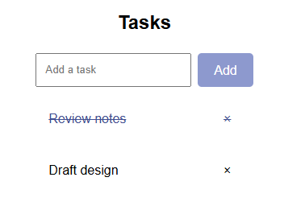
- Users can add tasks
- Tasks can be marked as complete
- Tasks can be removed individually
- Task interactions provide immediate visual feedback

### Session Feedback
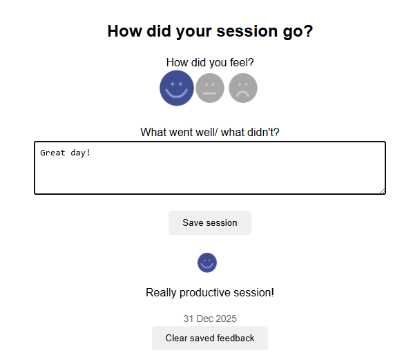
- Users can select a mood emoji
- Users can add optional written feedback
- Feedback is saved using browser local storage
- Each feedback entry includes a date stamp
- Saved feedback persists across page reloads

### How to use the timer page
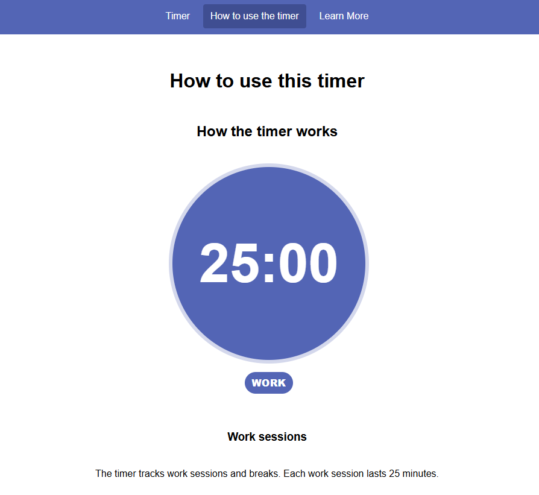
- Detailed guide on how to use the timer
- Explains all features on the main page, with accompanying screenshots

### Learn more page
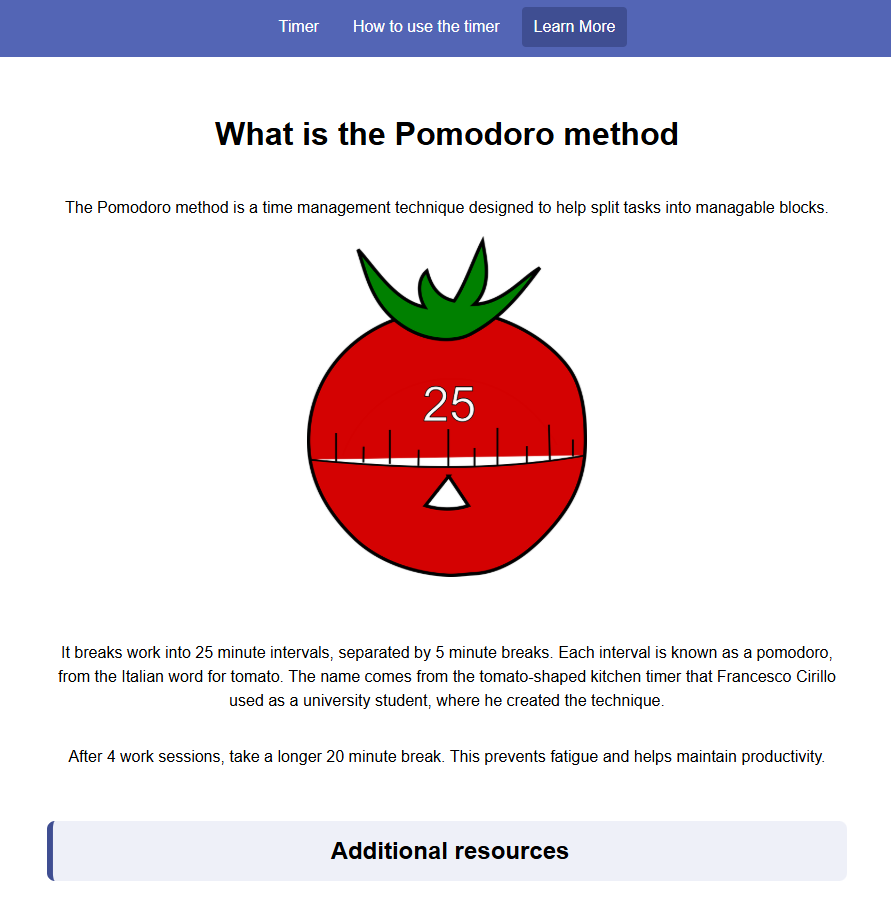
- Explanation of the Pomodoro Technique
- External resources for further reading

## Bugs

| Title | Description | Fix | Status |
|-------|-------------|-----|--------|
| Start not working on first click | The user has to click the "Start" button twice when the page is loaded to start the timer. | Changed 'let isPaused = false' to 'let isPaused = true' at the start of the script.js file. | Resolved |
| Nav bar not pinned to top of page | The navigation bar was in a variable position depending on the amount of content on a page | Added a "page" class that kept the centered formatting, and moved the nav bar outside of it. | Resolved |
| Feedback not saving emojis | Users can save text on how their session was, but emojis are not saving or being displayed. | Updated the script so that selected emojis are saved and displayed above saved feedback. | Resolved |
| Tasks striking through instead of closing when clicking on cross | After adding a task, the first click on the 'cross' strikes the task through rather than closing it. | Issue was not the strike through formatting, but the size of the close cross. Increased the area of the close cross to make it easier to click. | Resolved |
| Timer not automatically switching to break | When running the timer, once the timer completes a session it is not automatically switching to the next timer. Users have to click "Pause/Start" before it switches. | Issue was caused because the timerUpdate function was checking to see if the timer had reached 00:00 before decreasing the time. Changed the timerUpdate function so that time decreases before the function checks if the timer has reached 00:00. | Resolved |

## Testing

The project has been thoroughly tested, both manually and using automated tests. 

### Manual Testing

| Feature | Action | Expected Result | Actual Result | Pass/Fail |
|------|------|------|------|------|
| Start Timer | Click "Start" | Timer starts counting down, button changes to "Pause" | Works as expected | Pass |
| Pause Timer | Click "Pause" | Timer stops, button changes to "Start" | Works as expected | Pass |
| Restart Timer | Click "Restart" | Timer resets to 25:00 and pauses | Works as expected | Pass |
| Auto switch to break | Let work timer reach 00:00 | Timer switches to break automatically | Works as expected | Pass |
| Long break logic | Complete 4 work sessions | Long break starts on 4th cycle | Works as expected | Pass |
| Task creation | Add a task | Task appears in list | Works as expected | Pass |
| Task completion | Click a task | Task strikes through | Works as expected | Pass |
| Task deletion | Click on the 'x' next to a task | Task is removed from list | Works as expected | Pass |
| Feedback saving | Submit feedback | Feedback is saved and displayed | Works as expected | Pass |
| Feedback persistence | Reload page | Feedback remains visible | Works as expected | Pass |
| Clear feedback | Click on the 'Clear saved feedback' button | All saved feedback should be removed | Works as expected | Pass |
| Internal navigation | Click on each link in the nav bar to check the correct pages load | Nav bar should take users to the correct page | Works as expected | Pass |
| External navigation | Click on external links | Links should open in a new tab | Works as expected | Pass |
| Mobile navigation | Resize screen | Burger menu works correctly | Works as expected | Pass |

### Automated testing

jShint validator results:
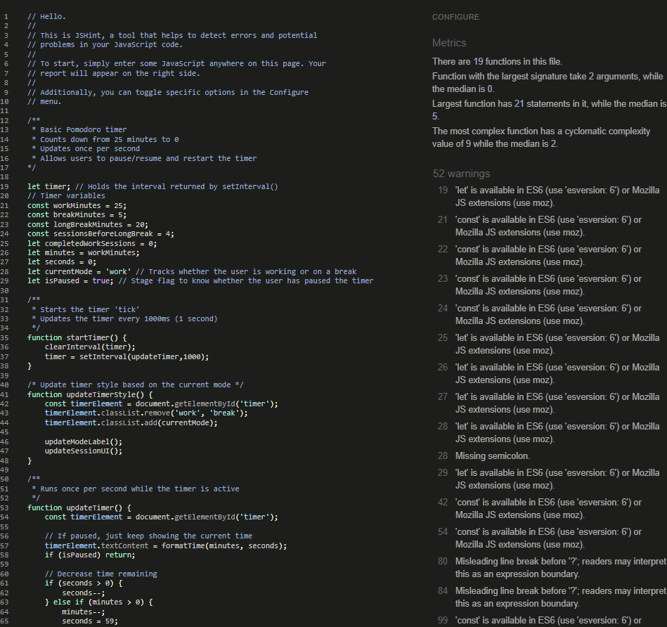

Of the warnings shown, the only ones that may impact a user's ability to use the site are the esversion 9 and esversion 11 availability. According to "Can I use", 95.7% of users can use optional chaining, so this risk is deemed acceptable. 
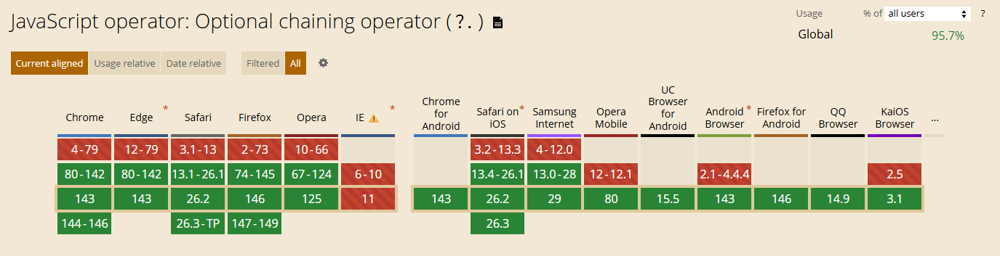

W3C HTML validator results:
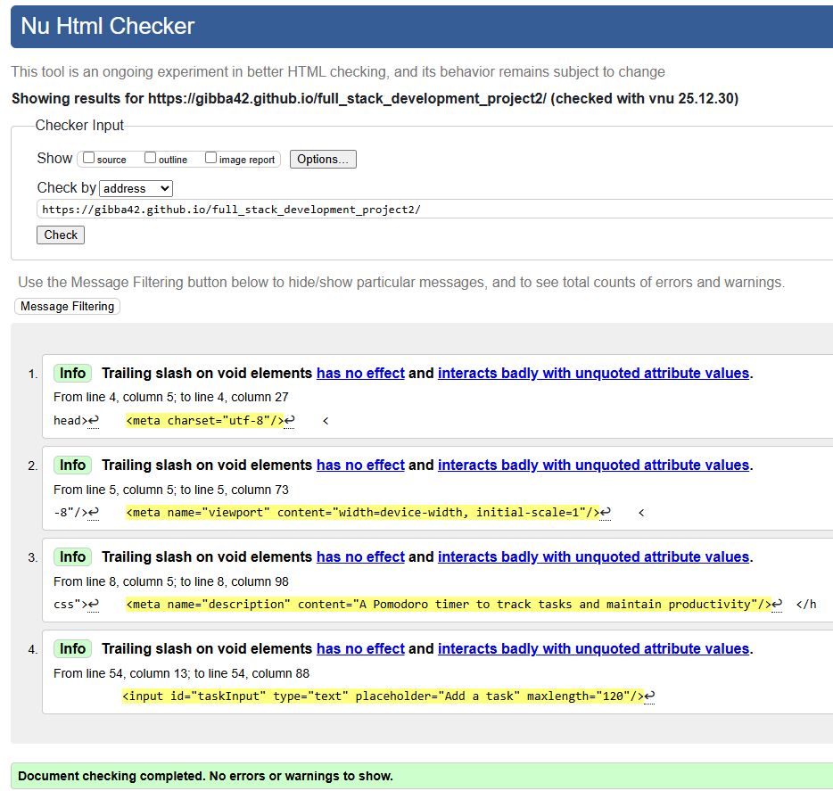

Jigsaw CSS validator results:
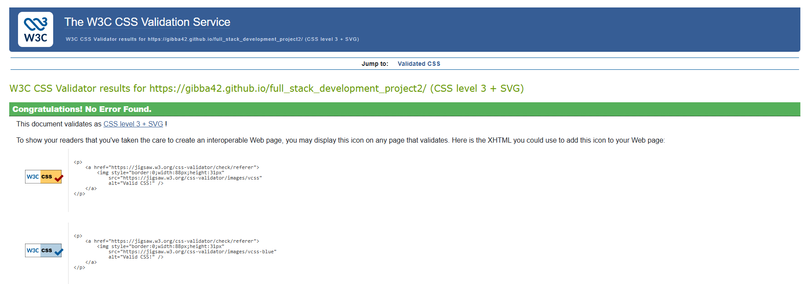

### Responsiveness testing

The pages were tested at 300px width, lower than the 320px requirement for robustness. Elements scaled correctly and no horizontal scroll bars appeared. 
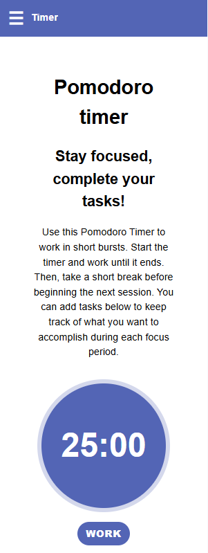

## Deployment

This project was deployed using **GitHub Pages**.

### Deployment Steps
1. Push final code to GitHub repository
2. Navigate to **Settings → Pages**
3. Select the `main` branch as the source
4. Save and wait for deployment to complete
5. Access the live site via the provided URL

## Credits

### Code from tutorials

- Pomodoro timer 
    - The basic functionality of the Pomodoro timer was based on the 'Geeks for Geeks - Create a Pomodoro timer using html css and javascript' tutorial. This was then built on to add additional functionality.
- Task list
    - The task list is based on the 'W3 Schools - How to js to do list' tutorial.
- Feedback form storage
    - The ability for users to save feedback on their sessions is based on the 'peerdh - Building a User Feedback System for Web Applications Using Local Storage' tutorial.

## Future Improvements

- Customisable timer durations
- Dark mode
- Session history analytics
- Exportable feedback data
- Audio notifications